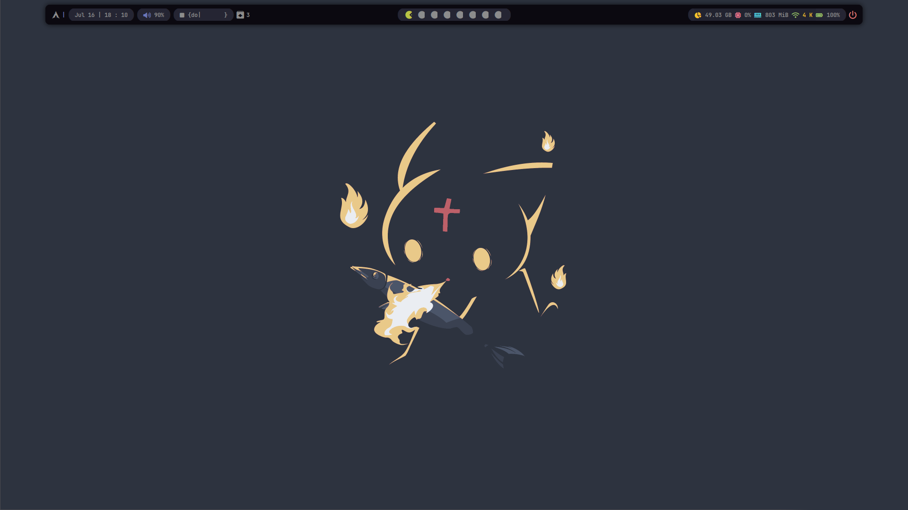
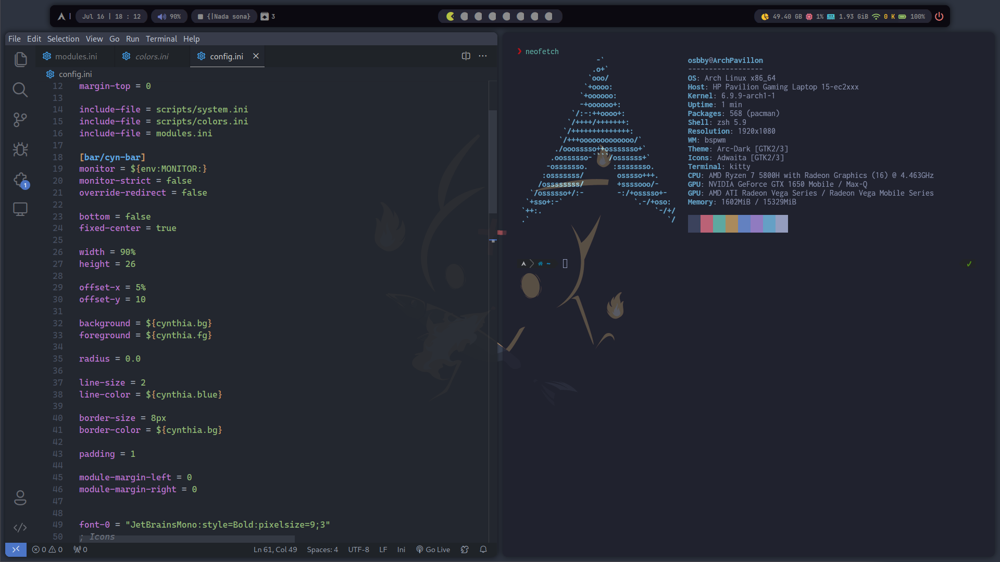
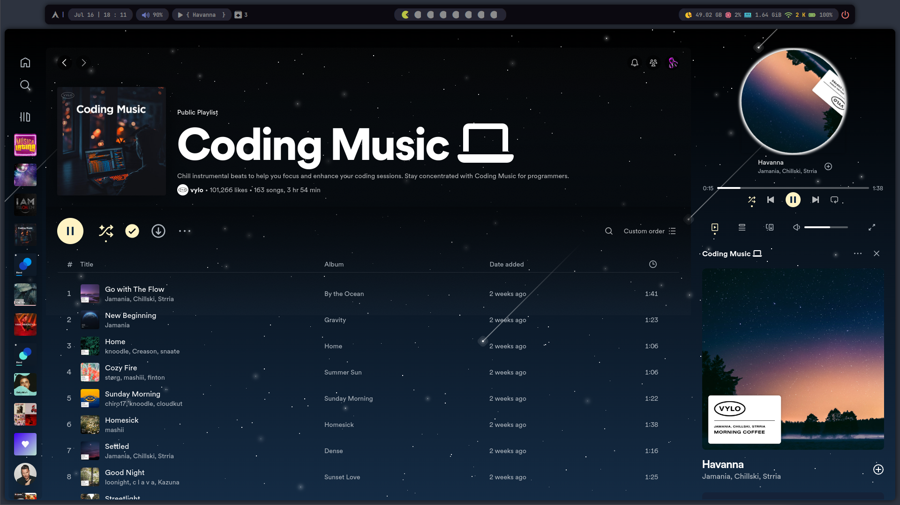
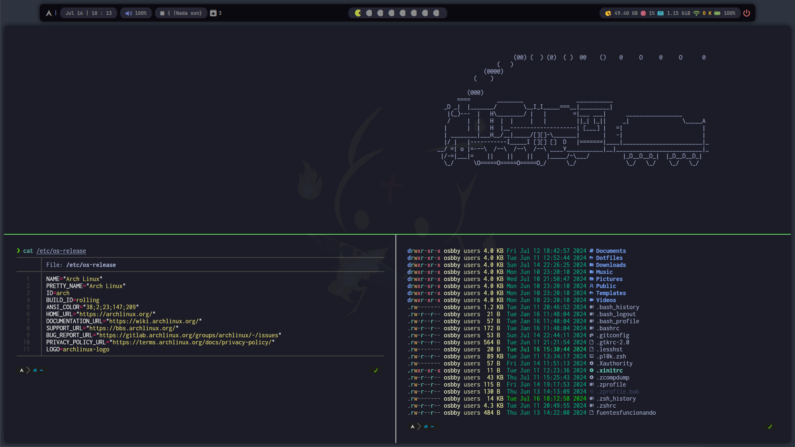
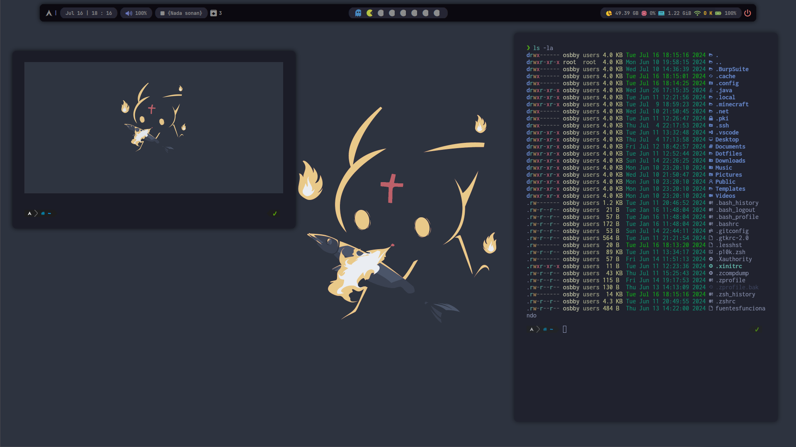

<h2 align="center"> ━━━━━━  ❖  ━━━━━━ </h2>

     <h1>Dotfiles Bspwm & Polybar for Arch Linux</h1>
 

<h2> INFORMATION </h2>
   Hello, welcome to my repository of my personal Dotfiles, I hope you like them!

   Here are more information about my setup:

   - **Distro:** [Arch Linux](https://github.com/archlinux)
   - **Window Manager:** [Bspwm](https://github.com/baskerville/bspwm)
   - **Terminal:** [Kitty](https://github.com/kovidgoyal/kitty)
   - **Shell:** [Zsh](https://www.zsh.org/)
        - **Zsh Theme:** [Powerlevel10k](https://github.com/romkatv/powerlevel10k)
   - **Bar:** [Polybar](https://github.com/polybar/polybar)
   - **Compositor:** [Picom](https://github.com/yshui/picom)
   - **Editor:** [VSCode](https://github.com/microsoft/vscode)
   - **Browser:** [Brave](https://github.com/brave/brave-browser)
   - **Notification Daemon:** [Dunst](https://github.com/dunst-project/dunst)
   - **Application Launcher:** [Rofi](https://github.com/davatorium/rofi)
   - **Music player:** [Spotify](https://github.com/spotify)
        - **Spotify Theme:** [Spicetify](https://github.com/spicetify)
 

<h2 align="center"> ━━━━━━  ❖  ━━━━━━ </h2>

   - **Inspiration**
      - [`gh0stzk`](https://github.com/gh0stzk)
      - [`rxyhn`](https://github.com/rxyhn)
      - [`r1vs3c`](https://github.com/r1vs3c)
      - [`s4vitar`](https://github.com/s4vitar)

 

<h2 align="center"> ━━━━━━  ❖  ━━━━━━ </h2>

<h2 align="center"> Some images of my environment </h2>

    <h4>Empty desktop</h4>

    <h4>Code editor</h4>

    <h4>My Spotify theme</h4>

    <h4>Kitty</h4>

    <h4>Floating windows</h4>

 

<h2 align="center"> ━━━━━━  ❖  ━━━━━━ </h2>

<h1 align="center">Thanks for watch!</h1>